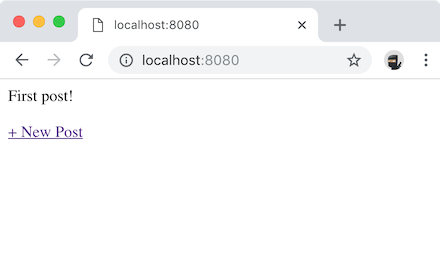
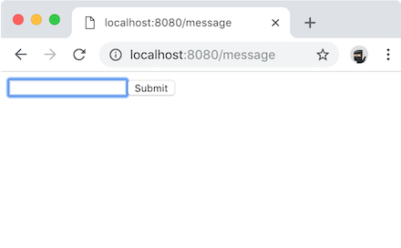

# node-tracing example

## Overview

This example illustrates a simple comment-wall application using Honeycomb's [Beeline for Node](https://docs.honeycomb.io/getting-data-in/javascript/beeline-nodejs/).

It contains examples of:

- Baseline Beeline usage in an Express app
- Capture of custom metadata on Beeline-generated events
- Definition of custom spans to augment traces
- In-app tracing (across functions within the same service)

## Usage:

Find your Honeycomb API key at https://ui.honeycomb.io/account, then:

## Install and Setup

```bash
npm run setup # installs packages and local beeline as dependency
```

## Running the main application

Run our sample `wall` service with:

```bash
# Will run on port 3000
$ npm start
```

### Interacting with your application

You may either use the web UI [`http://localhost:3000`](http://localhost:3000) to read and write messages:

|  |  |
| :--------------------------: | :----------------------------------: |
|    View contents of wall     |      Write new message on wall       |

Or `curl` the contents of your wall directly:

```bash
# Fetch the contents of your wall
curl localhost:3000
```

```bash
# Write a new message to your wall
curl localhost:3000 -d "message=i'm #tracing with @honeycombio"
```
